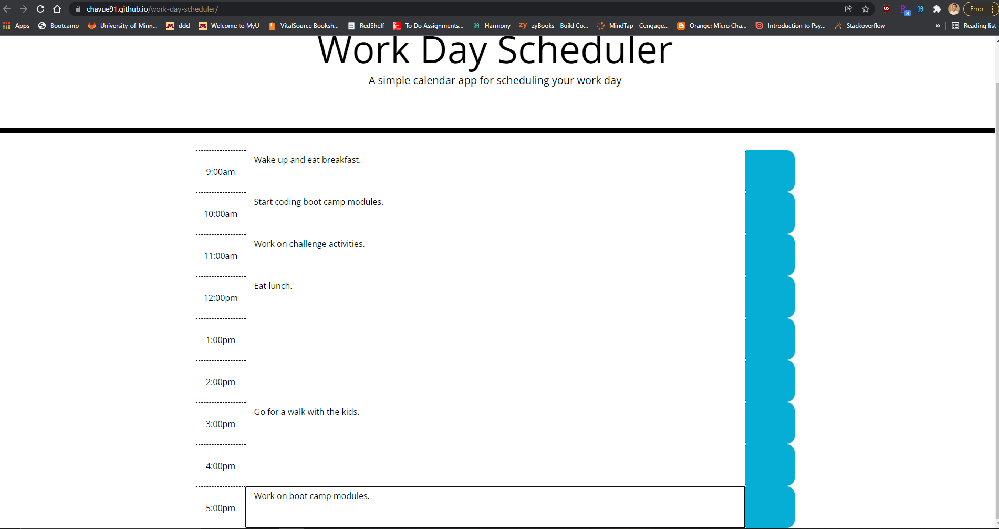

# Work Day Scheduler

A simple calendar application that allows the user to save events for each hour of the day. This app will run in the browser and feature dynamically updated HTML and CSS powered by jQuery.

## Website deployment 
[https://chavue91.github.io/work-day-scheduler/] (https://chavue91.github.io/work-day-scheduler/)

## Repo 
(https://github.com/chavue91/work-day-scheduler)

## images

